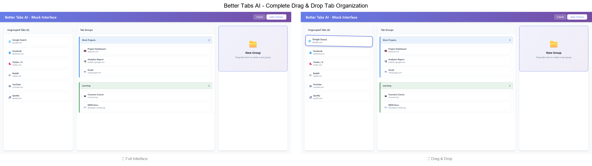
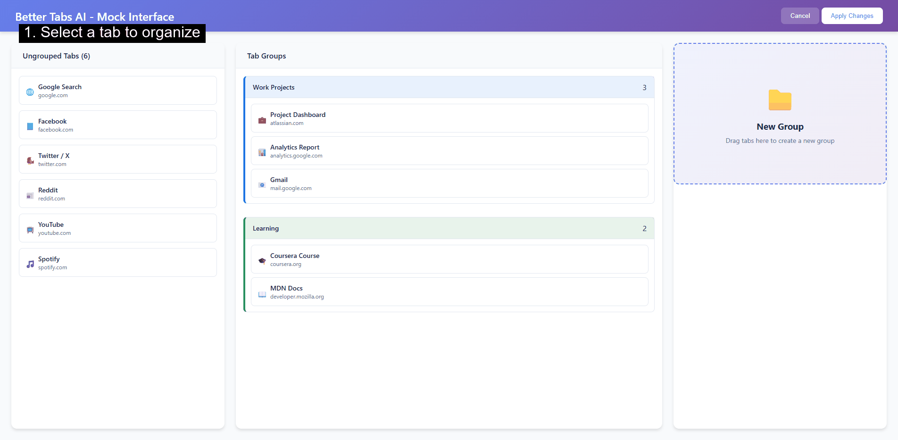

# Better Tabs AI

🤖 AI-powered Chrome extension for intelligent tab organization and management using Chrome's built-in Gemini Nano AI.

## Features

### 🎯 Core AI Features
- **AI-Powered Grouping**: Automatically categorize and group tabs by topic using Chrome's built-in AI
- **Granular Categorization**: Creates specific group names like "Amazon Shopping", "Python Development", "React Documentation"
- **Smart Content Analysis**: Staged analysis starting with metadata, expanding to full content when needed
- **Intelligent Suggestions**: AI analyzes ungrouped tabs and suggests adding them to existing groups
- **Manual Trigger**: Analyze tabs on-demand to keep things lightweight

### 🖱️ Full Drag & Drop Interface
- **Complete Visual Management**: Full-page interface with drag-and-drop tab organization
- **Staged Changes**: Apply/Cancel workflow - all changes staged until you click "Apply"
- **Interactive Group Management**: Create, rename, delete, and reorder groups with AI assistance
- **AI Name Generation**: Click sparkle (✨) button to generate intelligent group names
- **Visual Feedback**: Smooth animations, progress indicators, and conflict detection

### 🔍 Advanced Organization
- **Search & Filter**: Global search with individual filter options (domain, recency, type)
- **Duplicate Detection**: Find and merge duplicate tabs automatically
- **Bulk Operations**: Select multiple tabs for group operations, closing, or pinning
- **Smart Caching**: LRU cache with content-based invalidation for faster analysis

### 💡 User Experience
- **Minimal Popup**: Clean popup interface with link to full-featured management page
- **Real-time Updates**: Conflict detection when Chrome tabs change during editing
- **Toast Notifications**: Success/error feedback with detailed status messages
- **Privacy-First**: Uses local Chrome AI - no data sent to external servers

## Demo

### 📸 Interface Overview



Complete drag-and-drop interface with AI-powered tab organization

### 🎬 Drag & Drop Workflow



Drag tabs between groups with smooth visual feedback and staged changes

### 🤖 AI Suggestions in Action


AI analyzes ungrouped tabs and suggests intelligent groupings with confidence scores

## Latest Updates (v1.5.2)

### 🚀 Full Interface Implementation (Phases 1-6 Complete)

#### **✅ Phase 1: Foundation & Staged State Management**
- **Structure**: 3-column layout (Ungrouped | Groups | New Group Box) with complete component architecture
- **State Management**: Staged workflow with original/staged separation - all changes held until Apply
- **Components**: 12 React components including TabCard, GroupContainer, Header, Layout with error boundaries
- **Integration**: Popup button opens full interface in new tab, complete Chrome API wrapper
- **Styling**: Responsive grid layout, 60fps animations, gradient header design

#### **✅ Phase 2: Complete Drag & Drop with Performance Optimizations**
- **Drag & Drop**: Full dnd-kit integration - drag tabs between groups, reorder within groups, create new groups
- **Performance**: React.memo(), CSS containment, 0% memory growth, 60fps+ scrolling in testing
- **Layout**: Compact tab cards (36px), multi-column group grids, fixed column widths
- **Features**: DragOverlay for smooth previews, inline group name editing, Apply/Cancel workflow
- **Testing**: Comprehensive Selenium test suite with performance metrics documented

#### **✅ Phase 3: Enhanced Apply with Progress & AI Integration**
- **Apply System**: Progress indicators showing "Applying X/Y: Operation..." with batch processing
- **Toast Notifications**: Success/error/warning/info system with slide-in animations
- **Conflict Detection**: Auto-refresh when no changes, conflict banner for external vs unsaved changes
- **AI Integration**: Analyze button triggers background AI processing with polling for results
- **Error Handling**: Collects all errors instead of stopping on first, detailed console logging

#### **✅ Phase 4: Group Management & AI Naming**
- **AI Names**: Sparkle button (✨) generates concise group names using Gemini Nano ("Social Media", "Work Docs")
- **Color Management**: 8-color picker dropdown with visual active states and random unused color selection
- **Group Actions**: Delete with confirmation dialog, inline editing with 50 char limit, Enter/Escape handling
- **UI Polish**: Color swatch containers, hover animations, loading spinners during AI generation

#### **✅ Phase 5: AI Suggestions Inline Display**
- **Suggestions UI**: AI suggestions appear inline with existing groups, dashed borders + "Suggested" badge
- **Confidence Scores**: Visual confidence percentages, suggestions counter in column header
- **Actions**: Create button (✓) instantly creates group, Dismiss button (✗) removes suggestion
- **Integration**: Custom events for cross-component communication, immutable state updates
- **Workflow**: Analyze → Suggestions appear → Create/Dismiss → Regular groups with full editing

#### **✅ Phase 6: Search & Duplicate Detection**
- **Real-time Search**: Debounced search bar (300ms) filters by title and URL, clear button (×)
- **Duplicate Detection**: Automatic URL-based duplicate identification with warning badges
- **Filtering**: Search updates all columns in real-time, maintains drag & drop functionality
- **UI Elements**: Translucent search bar with backdrop blur, search icon, responsive design
- **Future Ready**: Foundation for advanced filters, AI confidence thresholds, search highlighting

### 🏗️ Architecture Improvements
- **Modern Build System**: Vite build process with React 18 and HTM (JSX-less syntax)
- **CSP Compliance**: Content Security Policy compliant with local React libraries
- **Service Worker Architecture**: AI processing entirely in background service worker
- **Performance Optimized**: React.memo, useCallback, and efficient state management

### 🔧 Technical Enhancements
- **LRU Cache System**: Proper cache with content-hash keys and automatic eviction (max 100 entries)
- **Error Handling**: 7 distinct AI error states with specific troubleshooting actions
- **Session Management**: Persistent AI sessions with automatic recovery on failure
- **Memory Management**: Content-based invalidation and bounded cache growth

## Requirements

- Chrome 118+ with AI features enabled
- At least 4GB GPU memory
- 22GB free storage space (for Gemini Nano model)
- Enable "Prompt API for Gemini Nano" in `chrome://flags`

## Installation

### Development Installation

1. **Clone or download this repository**

   ```bash
   git clone <repository-url>
   cd better-tabs-ai
   ```

2. **Icons are pre-generated** ✅
   - All required icon files (`icon16.png`, `icon32.png`, `icon48.png`, `icon128.png`) are included
   - No additional icon generation needed

3. **Enable Chrome AI Features**
   - Go to `chrome://flags`
   - Search for "Prompt API for Gemini Nano"
   - Enable the flag and restart Chrome

4. **Load the Extension**
   - Go to `chrome://extensions`
   - Enable "Developer mode" (top right toggle)
   - Click "Load unpacked"
   - Select the `better-tabs-ai` folder

5. **Setup Chrome AI**
   - Click the extension icon in the toolbar
   - If AI is not available, follow the setup instructions
   - The AI model will download automatically (may take several minutes)

## Usage

### 🎮 Quick Actions (Popup Interface)

1. **Click the extension icon** to open the popup
2. **Check AI Status** - Green dot means AI is ready, follow setup instructions if needed
3. **Analyze & Group Tabs** - AI analyzes ungrouped tabs and suggests intelligent groups
4. **Find Duplicates** - Identifies and highlights duplicate tabs for cleanup
5. **Clear Cache** - Reset analysis cache to force fresh AI analysis
6. **Open Full Interface** - Launch the complete drag-and-drop management interface

### 🎯 Full Interface (Complete Tab Management)

1. **Launch**: Click "🔧 Full Interface" in popup or navigate to the full interface page
2. **Drag & Drop**: Drag tabs between groups or create new groups visually
3. **Staged Changes**: All changes are staged until you click "Apply Changes"
4. **AI Assistance**: 
   - Click ✨ sparkle button to generate AI names for groups
   - View AI suggestions inline with existing groups
   - Accept or dismiss suggestions as needed
5. **Search & Filter**: Use the search bar to find specific tabs across all groups
6. **Bulk Operations**: Select multiple tabs (Ctrl/Shift+click) for group operations

### 🤖 How AI Analysis Works

1. **Metadata Analysis**: Extension extracts page titles, URLs, and basic metadata
2. **Content Analysis**: For ambiguous cases, analyzes page content intelligently
3. **Semantic Grouping**: Gemini Nano AI identifies topics and relationships between tabs
4. **Smart Suggestions**: Proposes specific group names like "Amazon Shopping" or "React Development"
5. **Context Awareness**: Considers existing groups and suggests additions when relevant

### 💡 Pro Tips

- **Staged Workflow**: In full interface, make all changes then "Apply" - nothing syncs immediately
- **AI Naming**: Use the sparkle (✨) button for intelligent group name suggestions
- **Conflict Detection**: If Chrome tabs change while editing, you'll see a "Refresh" banner
- **Search Everything**: Global search works across all tabs and groups simultaneously
- **Bulk Selection**: Ctrl+click (individual) and Shift+click (range) for multi-tab operations

## Architecture

### 🏗️ Core Components

#### **Service Worker (`background/service-worker.js`)**
- **BetterTabsAI Class**: Main AI processing engine with session management and LRU caching
- **Granular Analysis**: Enhanced prompt engineering for specific, actionable group names
- **Performance**: Content-based cache invalidation, 1-minute TTL, staged analysis workflow
- **APIs**: Chrome tabs/tabGroups integration, LanguageModel API with proper error handling

#### **Popup Interface (`popup/`)**
- **PopupManager**: CSP-compliant event handling, AI status checking, cache management
- **Quick Actions**: Instant analysis, group management, link to full interface
- **Design**: Compact 400x600px layout optimized for browser extension toolbar

#### **Full Drag & Drop Interface (`full-interface/`)**
- **React 18 + HTM**: CSP-compliant React without JSX compilation
- **Vite Build System**: Modern bundling with hot reload, local libraries for CSP compliance
- **dnd-kit Integration**: Sophisticated drag & drop with performance optimization
- **Staged State Management**: Original/staged separation with Apply/Cancel workflow

### 🤖 AI Integration

#### **Gemini Nano Processing**
- **Local Model**: Chrome's built-in AI with no external API calls required
- **Session Management**: Persistent sessions with proper cleanup and error recovery
- **Language Specification**: English language specification to prevent timeout errors
- **Advanced Prompting**: Context-aware analysis for granular, specific categorization

#### **Caching Strategy**
- **LRU Cache**: Content-based invalidation with 100-entry limit
- **Performance**: Sub-100ms cache hits, content hash detection for changes
- **Invalidation**: Tab update listeners, user-configurable durations

### 🔄 Data Flow

#### **Analysis Workflow**
```
Chrome Tabs → Content Extraction → AI Processing → Group Generation → UI Updates
     ↓               ↓                    ↓              ↓             ↓
  Metadata      Page Content        Gemini Nano      Suggestions   Real-time
  Extraction    (when needed)       Local Analysis   with Names    Interface
```

#### **State Management (Full Interface)**
```
Original State (Chrome) ← Apply/Cancel ← Staged State (Working Copy)
       ↓                                        ↑
   Auto-refresh                             Drag & Drop
   (no changes)                             User Edits
       ↓                                        ↑
 Conflict Detection                        AI Suggestions
```

### 📁 Project Structure

```text
better-tabs-ai/
├── manifest.json                 # Extension configuration v1.5.2
├── background/
│   └── service-worker.js        # Core AI processing & caching
├── popup/                       # Quick interface (400x600px)
│   ├── popup.html              
│   ├── popup.js                # PopupManager class
│   └── popup.css               
├── full-interface/             # Complete drag & drop interface
│   ├── app.jsx                 # Main React app with staged state
│   ├── components/             # 12 React components
│   │   ├── Layout.jsx          # DndContext + 3-column grid
│   │   ├── GroupContainer.jsx  # Groups with editing/AI/colors
│   │   ├── TabCard.jsx         # Draggable tab display
│   │   ├── SuggestedGroup.jsx  # AI suggestions display
│   │   └── ...                 # Headers, columns, utilities
│   ├── hooks/                  # React hooks (placeholder)
│   ├── utils/                  # Chrome API, diff calculator, batch operations
│   ├── styles/                 # CSS with containment optimizations
│   ├── dist/                   # Vite build output
│   ├── package.json            # React 18, dnd-kit, development dependencies
│   └── vite.config.js          # Build configuration
├── content-scripts/            # Future: Page content extraction
├── icons/                      # Extension icons (16-128px)
└── tests/                      # Selenium test suite + performance tests
│   ├── lib/                     # Local React libraries (CSP compliant)
│   └── dist/                    # Vite build output
├── content-scripts/
│   └── content-script.js        # Page content extraction
├── icons/                       # Extension icons (16, 32, 48, 128px)
└── utils/
    └── cache-manager.js         # LRU cache implementation
```

### 🎨 Full Interface Architecture

- **React 18**: Modern React with hooks and functional components
- **HTM (Hyperscript Tagged Markup)**: JSX-like syntax without compilation
- **Staged State Management**: Apply/Cancel workflow with conflict detection
- **dnd-kit**: Modern drag-and-drop with accessibility support
- **Vite Build**: Fast development and optimized production builds
- **CSP Compliance**: All libraries loaded locally, no inline scripts

## Privacy & Security

- **Local Processing**: All AI analysis happens locally on your device using Chrome's Gemini Nano
- **No External APIs**: No data sent to external servers or third-party services
- **Minimal Storage**: Only caches analysis results and user preferences locally
- **Permission Transparency**: Only requests necessary Chrome APIs (tabs, tabGroups, scripting, storage)
- **Content Security Policy**: Strict CSP with local libraries, no inline scripts or external resources

## Contributing

1. Fork the repository
2. Create a feature branch (`git checkout -b feature/amazing-feature`)
3. Make your changes and test thoroughly
4. Commit your changes (`git commit -m 'Add amazing feature'`)
5. Push to the branch (`git push origin feature/amazing-feature`)
6. Submit a pull request

## Development Setup

```bash
# Clone the repository
git clone https://github.com/nadiar/better-tabs-ai.git
cd better-tabs-ai

# For full interface development
cd full-interface
npm install
npm run dev    # Development server
npm run build  # Production build
```

## License

MIT License - see LICENSE file for details.

## Roadmap

### ✅ Completed Features
- [x] AI-powered tab analysis with Chrome Gemini Nano
- [x] Full-page drag-and-drop interface with React
- [x] Staged changes workflow (Apply/Cancel)
- [x] AI group name generation and suggestions
- [x] Search and filtering capabilities
- [x] Duplicate tab detection and management
- [x] LRU caching system with performance optimization
- [x] Complete error handling and status management

### 🚧 In Progress
- [ ] Enhanced AI grouping logic (addressing semantic relationships)
- [ ] Mobile/tablet interface adaptation
- [ ] Advanced keyboard navigation and accessibility

### 🔮 Future Features
- [ ] Custom grouping rules and user-defined categories
- [ ] Tab usage analytics and insights
- [ ] Automatic tab archiving for old/unused tabs
- [ ] Export/import settings and group configurations
- [ ] Browser sync for cross-device group management
- [ ] Plugin system for custom AI providers
- [ ] Advanced search with regex and boolean operators

---

**Note**: This extension requires Chrome's experimental AI features. AI availability may vary based on your system configuration and Chrome version.